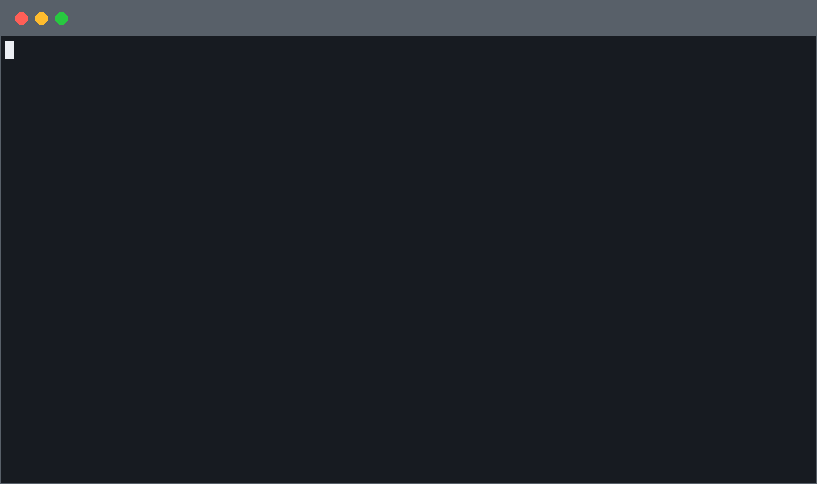

<p align="center">
  <picture>
    <source media="(prefers-color-scheme: dark)" srcset="assets/banner-wide-dark.png">
    <source media="(prefers-color-scheme: light)" srcset="assets/banner-wide-light.png">
    
  </picture>
</p>

<p align="center">
  <a href="https://romain-gilliotte.github.io/spectral/getting-started/installation/"><strong>Getting started</strong></a> &nbsp;&bull;&nbsp;
  <a href="https://romain-gilliotte.github.io/spectral/reference/cli/"><strong>CLI reference</strong></a> &nbsp;&bull;&nbsp;
  <a href="https://romain-gilliotte.github.io/spectral/"><strong>Full documentation</strong></a>
</p>

Browse any website or mobile app normally. Spectral observes what you do, figures out the meaning behind each API call, and builds MCP tools that let AI agents use the same app.

<p align="center">
  
</p>

## Why Spectral

Most apps — web, mobile, desktop — sit on top of undocumented HTTP APIs. Spectral records the traffic while you browse, uses an LLM to understand what each call does, and generates MCP tools that any AI agent can call.

- **Works everywhere.** Websites, mobile apps (Android), desktop apps, CLI tools — if it speaks HTTPS, Spectral can capture it.

- **Understands what you do, not just what the network sends.** Spectral correlates your clicks and navigation with API calls to figure out the business meaning of each endpoint — not just its shape.

- **Tools that fix themselves.** When a generated tool fails at runtime, the MCP server feeds the error back to an LLM and patches the tool automatically.

- **LLM at build time, not at runtime.** The LLM is only used during analysis and self-repair. Once your tools work, every call is a direct HTTP request — fast, cheap, and deterministic.

- **Faster than browser automation.** No headless browser, no fragile selectors, no waiting for pages to render. Spectral tools call the API directly, which is orders of magnitude faster and more reliable than controlling a browser with an agent.

- **Also generates API specs.** Beyond MCP tools, Spectral can produce OpenAPI 3.1 specs from REST traffic and GraphQL SDL schemas from GraphQL traces — useful for documentation, code generation, or feeding other tools.

## How it works

1. **Capture** — Chrome extension (web) or MITM proxy records traffic while you use the app
2. **Analyze** — An LLM correlates your actions with API calls, infers endpoint patterns, auth flow, and business meaning
3. **Use** — Start the MCP server. AI agents call the API directly, with auth handled automatically

## Quick start

Prerequisites: Python 3.11+, [uv](https://docs.astral.sh/uv/), [Anthropic API key](https://console.anthropic.com/).

```bash
git clone https://github.com/romain-gilliotte/spectral.git && cd spectral
uv sync
```

Capture traffic (pick one):

```bash
# Web apps — Chrome extension
spectral extension install --extension-id <id-from-chrome-extensions>
# Start Capture → browse → Stop Capture → Send to Spectral

# Mobile / desktop / CLI — MITM proxy
spectral capture proxy -a myapp
```

Analyze and authenticate:

```bash
spectral mcp analyze myapp          # generate MCP tools
spectral auth analyze myapp         # detect auth, generate login script
spectral auth login myapp           # interactive login
```

Add the MCP server to Claude (in `claude_desktop_config.json` or `.mcp.json`):

```json
{
  "mcpServers": {
    "spectral": {
      "command": "spectral",
      "args": ["mcp", "stdio"]
    }
  }
}
```

## Documentation

| Guide                                                                                           | Description                                    |
| ----------------------------------------------------------------------------------------------- | ---------------------------------------------- |
| [Installation](https://romain-gilliotte.github.io/spectral/getting-started/installation/)       | Setup: CLI, Chrome extension, native messaging |
| [First capture](https://romain-gilliotte.github.io/spectral/getting-started/first-capture/)     | Record traffic from a web app or mobile app    |
| [First analysis](https://romain-gilliotte.github.io/spectral/getting-started/first-analysis/)   | Generate MCP tools from captured traffic       |
| [Calling the API](https://romain-gilliotte.github.io/spectral/getting-started/calling-the-api/) | Use the MCP server with Claude                 |
| [CLI reference](https://romain-gilliotte.github.io/spectral/reference/cli/)                     | All commands and options                       |
| [Auth detection](https://romain-gilliotte.github.io/spectral/analyze/auth-detection/)           | How Spectral handles authentication            |

## License

[MIT](LICENSE)
